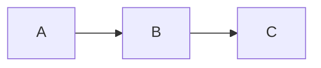

# pi-fence

> A [pi coding agent](https://pi.dev/) extension that processes fenced code blocks — so a ```` ```mermaid ```` block becomes a rendered diagram, a ```` ```csv ```` block becomes a formatted table, and so on. Pluggable processor registry: start with what's built in, plug in anything else you need.

**Status:** early scaffolding. No functionality yet. See the [roadmap](docs/project/roadmap/README.md).

---

## The idea

When the LLM writes this:

````markdown

````

…you shouldn't have to copy/paste it somewhere to see what it means. pi-fence intercepts the fenced block, runs it through a processor (Kroki, Graphviz, mmdc, your own plugin), and shows the rendered image inline in the terminal.

The same mechanism works for anything text-to-visual: syntax-highlighted code, formatted tables from CSV, QR codes, math, music notation. The core is a registry of **fence processors**; diagrams are just the first application.

## Status

Scaffold only — no processors, no hooks, no rendering yet. This repo currently exists to align on shape. Implementation proceeds story by story, tracked in the [worklog](docs/process/worklog.md).

## Docs

- **[Docs index](docs/README.md)** — start here
- **[Getting started](docs/getting-started.md)** — install and quick test (once there's something to install)
- **[Roadmap](docs/project/roadmap/README.md)** — what we're building and the order
- **[Briefing](docs/project/briefing.md)** — foundational architectural decisions
- **[Principles](docs/product/principles.md)** — how we build and test
- **[Worklog](docs/process/worklog.md)** — what was done, what's next

## Development

This project uses [pnpm](https://pnpm.io). The `packageManager` field in `package.json` pins the version; use corepack to avoid global installs:

```bash
corepack enable          # one time, once per machine
pnpm install
```

Without corepack, `pnpm install` works as long as you have pnpm 10.x available on PATH.

## License

MIT © 2026 Henrique Bastos
