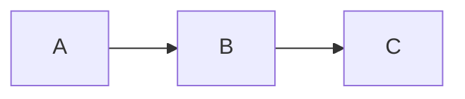

# pi-fence

> A [pi coding agent](https://pi.dev/) extension that processes fenced code blocks — so a ```` ```mermaid ```` block becomes a rendered diagram, a ```` ```csv ```` block becomes a formatted table, and so on. Pluggable processor registry: start with what's built in, plug in anything else you need.

**Status:** full Kroki text coverage + local graphviz + per-tag user bindings. Every text-body language the public [kroki.io](https://kroki.io) endpoint serves as PNG renders inline — `mermaid`, `graphviz`/`dot`, `plantuml`/`puml`, the `blockdiag` family (`blockdiag`, `seqdiag`, `actdiag`, `nwdiag`, `packetdiag`, `rackdiag`), plus `c4plantuml`, `ditaa`, `erd`, `structurizr`, `symbolator`, `tikz`, `umlet`, `wireviz`. With `graphviz` installed locally, `graphviz`/`dot` blocks render via the local `dot` binary instead of kroki.io — privacy and offline work out of the box for DOT. Users can override the default processor per tag in a small config file (`~/.pi/agent/pi-fence.config.json` or project-local `.pi/pi-fence.config.json`); see [docs/getting-started.md](docs/getting-started.md#binding-a-tag-to-a-specific-processor). SVG-only Kroki languages (including `d2`), JSON-body languages (Vega, Vega-Lite, Excalidraw), local rendering for other languages, and richer configuration (`/fence doctor`, per-processor settings) are next on the [roadmap](docs/project/roadmap/README.md). See [docs/product/kroki-support.md](docs/product/kroki-support.md) for the full per-language reference.

---

## The idea

When the LLM writes this:

````markdown

````

…you shouldn't have to copy/paste it somewhere to see what it means. pi-fence intercepts the fenced block, runs it through a processor (Kroki, Graphviz, mmdc, your own plugin), and shows the rendered image inline in the terminal.

The same mechanism works for anything text-to-visual: syntax-highlighted code, formatted tables from CSV, QR codes, math, music notation. The core is a registry of **fence processors**; diagrams are just the first application.

## What works today

After installing pi-fence into pi:

1. Ask the assistant for any diagram the public [Kroki](https://kroki.io) endpoint renders as PNG.
2. The assistant writes the natural fenced block: ```` ```mermaid ````, ```` ```dot ````, ```` ```plantuml ````, ```` ```blockdiag ````, ```` ```wireviz ````, etc.
3. pi-fence intercepts `agent_end`, posts the source to `https://kroki.io`, and emits a custom message below the assistant's text containing the rendered PNG.
4. Your terminal displays the PNG inline (Ghostty, Kitty, iTerm2, WezTerm).

**Supported tags**: `mermaid`, `graphviz` (alias `dot`), `plantuml` (alias `puml`), `blockdiag`, `seqdiag`, `actdiag`, `nwdiag`, `packetdiag`, `rackdiag`, `c4plantuml`, `ditaa`, `erd`, `structurizr`, `symbolator`, `tikz`, `umlet`, `wireviz` — 17 canonical languages, two aliases. See [docs/product/kroki-support.md](docs/product/kroki-support.md) for minimal source examples per language, quirks worth knowing, and the list of Kroki languages pi-fence deliberately does *not* advertise yet (SVG-only on the public endpoint, JSON-body, or backend unavailable).

On expansion (ctrl+o on the rendered message) pi-fence also shows the original source in a code block for copy-paste, regardless of which supported tag you used.

**Theme tracking:** pi-fence requests `?theme=dark` from Kroki when pi's current theme is a dark one (any theme whose name does not contain `light`, `latte`, or `day` — including defaults like `dark`, `tokyo-night`, `catppuccin-mocha`, `gruvbox-dark`). On light pi themes the diagram is rendered in Kroki's default light style. The theme is re-read every turn, so switching pi themes mid-session takes effect on the next rendered block.

**Processor registry**: two processors ship in the box.

- `graphviz-local` — shells out to the local `dot` binary, source on stdin. Wins `graphviz`/`dot` blocks when `dot` is on your PATH; otherwise skipped silently in favour of Kroki. Zero configuration: install `graphviz` (`apt install graphviz` on Debian/Ubuntu, `brew install graphviz` on macOS, <https://graphviz.org/download/> otherwise) and pi-fence picks it up on the next `/reload`. Diagram sources never leave your machine for this tag.
- `kroki` — posts to the public [kroki.io](https://kroki.io) endpoint for every other tag (and for `graphviz`/`dot` when you don't have `graphviz` installed). Theme-aware (see above).

Resolution is capability-based by default: on a given session, the first registered processor whose `available()` probe returns ok and whose tags cover the block wins. Users can override per tag via `~/.pi/agent/pi-fence.config.json` (global) or `<cwd>/.pi/pi-fence.config.json` (per-project). Project overrides global. See [Binding a tag to a specific processor](docs/getting-started.md#binding-a-tag-to-a-specific-processor) for the shape.

**Slash commands**:

- `/fence list` — prints the registered processors, their availability, the tags each accepts, and any per-tag bindings the user configured. Offline, read-only. On a machine with both `dot` installed and network you see two `[registered]` rows; on a machine without `dot` you see `graphviz-local [unavailable]` with the install hint plus `kroki [registered]`. A `Bindings` section appears when the config file has any effective bindings; an `Ignored bindings` section appears for bindings that point to an unknown or unavailable processor.

**Tracing**:

Set `PI_FENCE_LOG_LEVEL` in the environment to see pi-fence's internal activity on stderr. Levels: `debug`, `info` (default), `warn`, `error`. Log lines look like:

```text
[pi-fence:pi-fence] debug: processor available {"id":"graphviz-local"}
[pi-fence:pi-fence] debug: processor available {"id":"kroki"}
[pi-fence:pi-fence] debug: agent_end parsed {"assistantTextBytes":142,"blocks":1}
[pi-fence:graphviz-local] debug: shelling out to dot {"tag":"dot","sourceBytes":23}
[pi-fence:graphviz-local] info: dot ok {"tag":"dot","bytes":2041}
[pi-fence:kroki] debug: request {"tag":"mermaid","krokiTag":"mermaid","url":"https://kroki.io/mermaid/png","sourceBytes":30}
[pi-fence:kroki] debug: response ok {"status":200,"tag":"mermaid","bytes":3254}
[pi-fence:command] debug: /fence invoked {"subcommand":"list"}
```

pi's TUI owns stdout; logs arrive on stderr, so redirect `2>` to capture them without disrupting the interface:

```bash
PI_FENCE_LOG_LEVEL=debug pi 2> /tmp/pi-fence.log
```

A user-facing `/fence trace` view inside pi is not yet built.

What does **not** work yet:

- Local rendering for languages other than `graphviz`/`dot` — mermaid via `mmdc`, plantuml via `plantuml.jar`, etc. See [CV2.E1](docs/project/roadmap/README.md).
- Explicit per-tag processor bindings in settings (CV0.E2.S2).
- `/fence doctor` (health probing) and configuration via `~/.pi/agent/pi-fence.config.json` (CV1.E1).
- Error feedback loop to the LLM (CV1.E2).
- Every CV past that (see [roadmap](docs/project/roadmap/README.md)).

## Docs

- **[Docs index](docs/README.md)** — start here
- **[Getting started](docs/getting-started.md)** — install and quick test (once there's something to install)
- **[Roadmap](docs/project/roadmap/README.md)** — what we're building and the order
- **[Briefing](docs/project/briefing.md)** — foundational architectural decisions
- **[Principles](docs/product/principles.md)** — how we build and test
- **[Worklog](docs/process/worklog.md)** — what was done, what's next

## Install (once published)

```bash
pi install npm:pi-fence
```

Then `/reload` inside pi, or restart.

pi-fence makes a single HTTP request to `https://kroki.io` per fenced block. Privacy-sensitive users can configure a self-hosted Kroki once CV1.E1 lands; until then the public endpoint is the only path.

## Development

This project uses [pnpm](https://pnpm.io). The `packageManager` field in `package.json` pins the version; use corepack to avoid global installs:

```bash
corepack enable          # one time, once per machine
pnpm install
pnpm run feedback        # implementation loop: fast tests + ext coverage + focused CRAP + docs + types + deps
pnpm test:watch          # watch the fast suite while editing
pnpm test:live           # live suite — needs network for kroki.io
                         #   Docker for container-binary tests (CV0.E2+)
pnpm run inspect:crap    # broader CRAP report over extensions/, scripts/, and non-live tests/
pnpm run inspect:sonar   # SonarQube experiment (requires SONAR_HOST_URL + SONAR_TOKEN)
```

Without corepack, `pnpm install` works as long as you have pnpm 10.x available on PATH. See [getting-started](docs/getting-started.md#development) for the full dev workflow.

## License

MIT © 2026 Henrique Bastos
