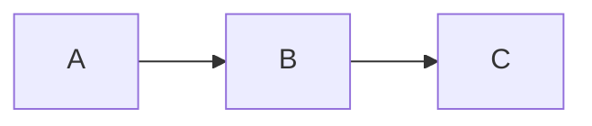

# pi-fence

> A [pi coding agent](https://pi.dev/) extension that processes fenced code blocks — so a ```` ```mermaid ```` block becomes a rendered diagram, a ```` ```csv ```` block becomes a formatted table, and so on. Pluggable processor registry: start with what's built in, plug in anything else you need.

**Status:** local/embedded processors + broad Kroki coverage + placement policy. Built-ins include local Graphviz, local Mermaid via `mmdc`, embedded table/highlight/QR/color processors, and `kroki-remote` for diagram languages served by [kroki.io](https://kroki.io). Users can bind tags, disable processors, configure Kroki endpoints, and restrict placement precedence in `~/.pi/agent/pi-fence.config.json` or project-local `.pi/pi-fence.config.json`; see [docs/getting-started.md](docs/getting-started.md#binding-a-tag-to-a-specific-processor). See [docs/product/kroki-support.md](docs/product/kroki-support.md) for the full per-language reference.

---

## The idea

When the LLM writes this:

````markdown

````

…you shouldn't have to copy/paste it somewhere to see what it means. pi-fence intercepts the fenced block, runs it through a processor (Kroki, Graphviz, mmdc, your own plugin), and shows the rendered image inline in the terminal.

The same mechanism works for anything text-to-visual: syntax-highlighted code, formatted tables from CSV, QR codes, math, music notation. The core is a registry of **fence processors**; diagrams are just the first application.

## What works today

After installing pi-fence into pi:

1. Ask the assistant for a supported fenced block: diagrams, CSV/JSONL tables, SQL/regex/jq highlighting, QR codes, or color swatches.
2. The assistant writes the natural fenced block: ```` ```mermaid ````, ```` ```dot ````, ```` ```csv ````, ```` ```qr ````, etc.
3. pi-fence intercepts `agent_end`, resolves a processor by placement policy, and emits a custom message below the assistant's text.
4. Your terminal displays the PNG or ANSI text inline (Ghostty, Kitty, iTerm2, WezTerm).

**Supported tags**: diagram tags include `mermaid`, `graphviz` (alias `dot`), `plantuml` (alias `puml`), `blockdiag`, `seqdiag`, `actdiag`, `nwdiag`, `packetdiag`, `rackdiag`, `c4plantuml`, `ditaa`, `erd`, `structurizr`, `symbolator`, `tikz`, `umlet`, `wireviz`, `vega`, `vegalite` (alias `vega-lite`), plus SVG→PNG rasterized `d2`, `bytefield`, `dbml`, `nomnoml`, `pikchr`, `svgbob`, `wavedrom`. Embedded tags include `csv`, `jsonl`, `sql`, `regex`, `jq`, `qr`, `color`, and `palette`. See [docs/product/kroki-support.md](docs/product/kroki-support.md) for diagram examples and quirks.

On expansion (ctrl+o on the rendered message) pi-fence also shows the original source in a code block for copy-paste, regardless of which supported tag you used.

**Theme tracking:** pi-fence requests `?theme=dark` from Kroki when pi's current theme is a dark one (any theme whose name does not contain `light`, `latte`, or `day` — including defaults like `dark`, `tokyo-night`, `catppuccin-mocha`, `gruvbox-dark`). On light pi themes the diagram is rendered in Kroki's default light style. The theme is re-read every turn, so switching pi themes mid-session takes effect on the next rendered block.

**Processor registry**: several processors ship in the box.

- `table-embedded`, `highlight-embedded`, `qr-embedded`, `color-embedded` — run inside pi-fence with no external service or host binary.
- `graphviz-host` — shells out to the local `dot` binary, source on stdin. By default it wins `graphviz`/`dot` blocks when `dot` is on your PATH and `host` placement is allowed; otherwise pi-fence falls through to the next allowed processor, typically Kroki. Zero configuration: install `graphviz` (`apt install graphviz` on Debian/Ubuntu, `brew install graphviz` on macOS, <https://graphviz.org/download/> otherwise) and pi-fence picks it up on the next `/reload`. Diagram sources never leave your machine for this tag when `graphviz-host` is selected.
- `mermaid-host` — shells out to `mmdc` when `@mermaid-js/mermaid-cli` is installed.
- `kroki-remote` — posts to the public [kroki.io](https://kroki.io) endpoint for every other tag (and for `graphviz`/`dot` when you don't have `graphviz` installed). Theme-aware (see above).

Resolution is placement-policy based by default: available `embedded` processors win before `host`, then `sandbox`, then `remote`. Users can override per tag via `~/.pi/agent/pi-fence.config.json` (global) or `<cwd>/.pi/pi-fence.config.json` (per-project), and can restrict allowed placements with `processorPrecedence`. Bindings are exact tag-scoped constraints: use `{ "processor": "..." }` for one processor or a concrete placement selector such as `{ "placement": "host" }`. Tag names such as `graphviz` and `dot` bind independently. Project bindings override global bindings; safety controls (`disabled`, `processorPrecedence`) can only further restrict lower-priority layers. See [Binding a tag to a specific processor](docs/getting-started.md#binding-a-tag-to-a-specific-processor) for the shape.

**Slash commands**:

- `/fence list` — prints the registered processors, their availability, the tags each accepts, and any per-tag bindings the user configured. Offline, read-only. On a machine with both `dot` installed and network you see `graphviz-host [registered]`; on a machine without `dot` you see `graphviz-host [unavailable]` with the install hint plus `kroki-remote [registered]`. Embedded processors show as `[registered]` because they have no external dependency. A `Bindings` section appears when the config file has any effective bindings; a `Binding issues` section appears for unsatisfied selectors, including unknown, disabled, unavailable, placement-disabled, non-claiming, no-match, or ambiguous bindings.

**Tracing**:

Set `PI_FENCE_LOG_LEVEL` in the environment to see pi-fence's internal activity on stderr. Levels: `debug`, `info` (default), `warn`, `error`. Log lines look like:

```text
[pi-fence:pi-fence] debug: processor available {"id":"graphviz-host"}
[pi-fence:pi-fence] debug: processor available {"id":"kroki-remote"}
[pi-fence:pi-fence] debug: agent_end parsed {"assistantTextBytes":142,"blocks":1}
[pi-fence:pi-fence] debug: processor resolution {"tag":"dot","processor":"graphviz-host","steps":[{"id":"graphviz-host","outcome":"selected-by-placement"}]}
[pi-fence:graphviz-host] debug: shelling out to dot {"tag":"dot","sourceBytes":23}
[pi-fence:graphviz-host] info: dot ok {"tag":"dot","bytes":2041}
[pi-fence:kroki-remote] debug: request {"tag":"mermaid","krokiTag":"mermaid","url":"https://kroki.io/mermaid/png","sourceBytes":30}
[pi-fence:kroki-remote] debug: response ok {"status":200,"tag":"mermaid","bytes":3254}
[pi-fence:command] debug: /fence invoked {"subcommand":"list"}
```

pi's TUI owns stdout; logs arrive on stderr, so redirect `2>` to capture them without disrupting the interface:

```bash
PI_FENCE_LOG_LEVEL=debug pi 2> /tmp/pi-fence.log
```

Resolution diagnostics live in structured debug logs; `/fence trace` is not part of the command surface.

What does **not** work yet:

- Local rendering for diagram languages beyond Graphviz and Mermaid — for example PlantUML via `plantuml.jar`. See the [roadmap](docs/project/roadmap/README.md).
- Sandbox placement is reserved for policy work; no built-in sandboxed processor ships yet.
- Every later CV (see [roadmap](docs/project/roadmap/README.md)).

## Docs

- **[Docs index](docs/README.md)** — start here
- **[Getting started](docs/getting-started.md)** — install and quick test (once there's something to install)
- **[Roadmap](docs/project/roadmap/README.md)** — what we're building and the order
- **[Briefing](docs/project/briefing.md)** — foundational architectural decisions
- **[Principles](docs/product/principles.md)** — how we build and test
- **[Worklog](docs/process/worklog.md)** — what was done, what's next

## Install (once published)

```bash
pi install npm:pi-fence
```

Then `/reload` inside pi, or restart.

By default, diagram tags without a local/embedded processor render through `kroki-remote`, which makes one HTTP request to `https://kroki.io` per fenced block. Privacy-sensitive users can point `kroki.endpoint` at a self-hosted Kroki instance or disable the remote processor with `"disabled": ["kroki-remote"]`.

## Development

This project uses [pnpm](https://pnpm.io). The `packageManager` field in `package.json` pins the version; use corepack to avoid global installs:

```bash
corepack enable          # one time, once per machine
pnpm install
pnpm test:watch          # red/green while editing
pnpm run feedback        # TDD loop — every commit (tests + CRAP + lint)
pnpm run inspect         # completion — when TDD session feels done (broader CRAP + Sonar)
pnpm test:live           # live I/O — new/changed processor (needs Docker/network)
pnpm run render:verify   # acceptance — before closing an epic (headless UI screenshots)
```

Without corepack, `pnpm install` works as long as you have pnpm 10.x available on PATH. See [getting-started](docs/getting-started.md#development) for the full dev workflow.

## License

MIT © 2026 Henrique Bastos
