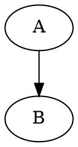

[< Docs](../README.md)

# Kroki language support

pi-fence's `kroki-remote` processor posts fenced-block sources to [Kroki](https://kroki.io)'s public endpoint at `https://kroki.io/<tag>/png` unless config points it at a self-hosted endpoint. This page documents, per language Kroki hosts, whether pi-fence can render it today and why (or why not).

Last updated: 2026-04-26 (CV9.E1.S1).

## Quick summary

1. **19 languages render today** on the public endpoint — 17 text-body + 2 JSON-source (Vega, Vega-Lite). All listed below with minimal canonical sources.
2. **7 languages** were SVG-only on the public endpoint but now render via pi-fence's local SVG→PNG rasterization (`@resvg/resvg-js`): `d2`, `bytefield`, `dbml`, `nomnoml`, `pikchr`, `svgbob`, `wavedrom`. pi-fence requests SVG from Kroki and rasterizes locally — the source still travels to kroki.io but the PNG conversion happens on your machine.
3. **3 languages** have backend infrastructure unavailable on Kroki's public endpoint: `bpmn`, `excalidraw`, and `diagramsnet`. Kroki answers with connection refused errors. Deferred until self-hosted Kroki with those backends enabled.

## Supported on public Kroki (PNG) — rendered by pi-fence today

Each entry is verified by a live integration test at `tests/integration/kroki.live.test.ts`, driven from the canonical-sources fixture at `tests/fixtures/kroki/canonical-sources.ts`.

| Tag | Aliases pi-fence accepts | Notes |
|-----|--------------------------|-------|
| `mermaid` | — | Flowcharts, sequence diagrams, state diagrams, class diagrams, etc. |
| `graphviz` | `dot` | DOT language; aliases to `/graphviz/png`. **Default local precedence:** if `graphviz` is installed on the host (`dot` on PATH) and `host` placement is allowed, pi-fence's `graphviz-host` processor renders this tag via the local binary instead of kroki.io unless a binding or precedence config chooses another processor. See [getting-started](../getting-started.md#going-offline-for-dot). |
| `plantuml` | `puml` | Full PlantUML. Aliases to `/plantuml/png`. |
| `blockdiag` | — | Box-and-arrow block diagrams. |
| `seqdiag` | — | Sequence diagrams in the blockdiag family. |
| `actdiag` | — | Activity diagrams in the blockdiag family. |
| `nwdiag` | — | Network diagrams in the blockdiag family. |
| `packetdiag` | — | Network packet layout diagrams. |
| `rackdiag` | — | Rack-layout diagrams. |
| `c4plantuml` | — | PlantUML with the [C4-PlantUML](https://github.com/plantuml-stdlib/C4-PlantUML) stdlib pre-included. Slower than plain PlantUML because Kroki fetches the stdlib over HTTPS at render time. |
| `ditaa` | — | ASCII-art → rendered diagrams. |
| `erd` | — | Entity-Relationship Diagrams (the DSL-driven kind). |
| `structurizr` | — | Structurizr DSL. Needs the full `workspace { model { ... } views { systemContext <id> { ... } } }` scaffold — partial DSL fails with a parse error. |
| `symbolator` | — | VHDL/Verilog entity pin-diagram renderer. |
| `tikz` | — | LaTeX TikZ drawings. Requires a full LaTeX document (`\documentclass{standalone}`, `\begin{document}` … `\end{document}`), not a bare `tikzpicture` block. |
| `umlet` | — | UMLet XML format. Verbose but stable. |
| `wireviz` | — | YAML connector / cable / connection definitions. |
| `vega` | — | [Vega](https://vega.github.io/vega/) visualisation grammar. Source is raw JSON sent as text/plain — no wrapping needed. |
| `vegalite` | `vega-lite` | [Vega-Lite](https://vega.github.io/vega-lite/) — higher-level Vega. Alias `vega-lite` resolves to `/vegalite/png`. |

### Usage

Ask the assistant for any of these in the natural way. The LLM writes a fenced block with the tag, pi-fence posts the source to Kroki, the PNG renders inline. Examples:

````markdown

````

````markdown

````

````markdown
```wireviz
connectors:
  X1:
    type: D-Sub
    pinlabels: [RX, TX, GND]
```
````

The `/fence list` slash command reports the full list at runtime.

### Theme tracking

pi-fence requests `?theme=dark` from Kroki when pi's current theme is a dark one. Light themes (`light`, `solarized-light`, `github-light`, `catppuccin-latte`, `day`) get Kroki's default rendering. Theme is re-read every turn, so switching pi themes mid-session takes effect on the next rendered block.

## SVG→PNG rasterized languages

These languages render via SVG from Kroki's public endpoint, rasterized to PNG locally by pi-fence using `@resvg/resvg-js`. The diagram source travels to kroki.io; the PNG conversion is local.

| Tag | Notes |
|-----|-------|
| `d2` | D2 diagrams. |
| `bytefield` | Byte-field diagrams from Clojure-like syntax. |
| `dbml` | Database Markup Language. |
| `nomnoml` | Simple UML-ish diagrams. |
| `pikchr` | SQLite project's PIC-derived diagram language. |
| `svgbob` | ASCII-art → SVG. |
| `wavedrom` | Digital timing diagrams (JSON source). |

## Backend unavailable on public Kroki

| Tag | Kroki-documented behaviour | Notes |
|-----|---------------------------|-------|
| `bpmn` | Backend unavailable | Kroki answers with connection refused. BPMN 2.0 XML. |
| `excalidraw` | Backend unavailable | Kroki answers with connection refused. JSON body. |
| `diagramsnet` | Backend unavailable | Kroki answers `503: Connection refused`. |

If you want one of these languages, run your own Kroki locally with the relevant backend enabled and point pi-fence at it. See [Configuring the Kroki endpoint](../getting-started.md#configuring-the-kroki-endpoint).

## Browsing a live gallery

`pnpm render:gallery` renders one tile per canonical language listed above, through the full user → assistant → `pi-fence:output` trail composition (the same shape the Render Image test layer uses). Each tile fetches a fresh PNG from `https://kroki.io` at runtime, so the gallery always reflects Kroki's current rendering, not a cached fixture.

```bash
pnpm render:gallery
open scripts/out/render-gallery/index.html
```

The command is **not a test gate** — no goldens, no pixel-diff, no CI. It exists so reviewers, contributors, and users can see every supported language rendered in context, one page. Re-run whenever you want a fresh snapshot for README screenshots, PR previews, or design review. Requires network access to `kroki.io`; languages that fail to fetch are reported on stderr and skipped rather than failing the whole run.

Per-tile output dimensions are auto-trimmed — a tall viewport (120×140 cells) accommodates even `ditaa` or `c4plantuml` in full, then each resulting PNG is cropped to its last non-empty row + a small bottom margin so every tile in the gallery is as compact as its content allows.

## Adding a language

If Kroki hosts a text-body language on its public endpoint that pi-fence doesn't yet support, extending is small:

1. Add an entry to `tests/fixtures/kroki/canonical-sources.ts` with the canonical tag, a minimal source, any aliases, and a calibrated `sizeFloorBytes`.
2. Add the tag to `KROKI_CANONICAL_TAGS` in `extensions/pi-fence/kroki.ts` (and to `KROKI_ALIASES` if the tag has a colloquial alias). No changes needed in `index.ts` — the supported-tag allowlist is derived dynamically via `collectSupportedTags()`.
3. `pnpm test:live` — the live integration test picks up the new entry automatically via the data-driven `for (const spec of KROKI_TEXT_LANGUAGES)` loop. Expect one new case, green on first run if the fixture source is valid.

No other test or wiring needs touching. The pi-fence renderer is language-agnostic; every new tag just rides the existing Kroki HTTP path.

---

**See also:** [Roadmap](../project/roadmap/README.md) · [CV0.E1 — Kroki Through The Wire](../project/roadmap/cv0--it-works/cv0-e1--kroki-through-the-wire.md) · [Principles — Testing](principles.md#testing)
