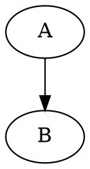

[< Docs](../README.md)

# Kroki language support

pi-fence's default processor posts fenced-block sources to [Kroki](https://kroki.io)'s public endpoint at `https://kroki.io/<tag>/png`. This page documents, per language Kroki hosts, whether pi-fence can render it today and why (or why not).

Last updated: 2026-04-20 (CV0.E1.S4).

## Quick summary

1. **17 text-body languages render today** on the public endpoint. They're all listed below with minimal canonical sources.
2. **8 text-body languages** are hosted by Kroki but refused as PNG on the public endpoint (Kroki answers `400: Unsupported output format: png … Must be one of svg.`). pi-fence's inline-PNG path via the Kitty graphics protocol can't serve them yet — see the deferred table and follow-up paths below.
3. **3 JSON-body languages** (Vega, Vega-Lite, Excalidraw) need a different request shape. They're scoped to [CV0.E1.S5](../project/roadmap/cv0--it-works/cv0-e1-s5--kroki-json-body-languages.md) and not yet implemented.
4. **1 language** (diagrams.net) has backend infrastructure unavailable on Kroki's public endpoint — Kroki answers `503: Connection refused`. Same status as the SVG-only set: deferred until self-hosted Kroki (CV2.E2) ships.

## Supported on public Kroki (PNG) — rendered by pi-fence today

Each entry is verified by a live integration test at `tests/integration/kroki.live.test.ts`, driven from the canonical-sources fixture at `tests/fixtures/kroki/canonical-sources.ts`.

| Tag | Aliases pi-fence accepts | Notes |
|-----|--------------------------|-------|
| `mermaid` | — | Flowcharts, sequence diagrams, state diagrams, class diagrams, etc. |
| `graphviz` | `dot` | DOT language; aliases to `/graphviz/png`. **Local precedence:** if `graphviz` is installed on the host (`dot` on PATH), pi-fence's `graphviz-local` processor renders this tag via the local binary instead of kroki.io. See [getting-started](../getting-started.md#going-offline-for-dot). |
| `plantuml` | `puml` | Full PlantUML. Aliases to `/plantuml/png`. |
| `blockdiag` | — | Box-and-arrow block diagrams. |
| `seqdiag` | — | Sequence diagrams in the blockdiag family. |
| `actdiag` | — | Activity diagrams in the blockdiag family. |
| `nwdiag` | — | Network diagrams in the blockdiag family. |
| `packetdiag` | — | Network packet layout diagrams. |
| `rackdiag` | — | Rack-layout diagrams. |
| `c4plantuml` | — | PlantUML with the [C4-PlantUML](https://github.com/plantuml-stdlib/C4-PlantUML) stdlib pre-included. Slower than plain PlantUML because Kroki fetches the stdlib over HTTPS at render time. |
| `ditaa` | — | ASCII-art → rendered diagrams. |
| `erd` | — | Entity-Relationship Diagrams (the DSL-driven kind). |
| `structurizr` | — | Structurizr DSL. Needs the full `workspace { model { ... } views { systemContext <id> { ... } } }` scaffold — partial DSL fails with a parse error. |
| `symbolator` | — | VHDL/Verilog entity pin-diagram renderer. |
| `tikz` | — | LaTeX TikZ drawings. Requires a full LaTeX document (`\documentclass{standalone}`, `\begin{document}` … `\end{document}`), not a bare `tikzpicture` block. |
| `umlet` | — | UMLet XML format. Verbose but stable. |
| `wireviz` | — | YAML connector / cable / connection definitions. |

### Usage

Ask the assistant for any of these in the natural way. The LLM writes a fenced block with the tag, pi-fence posts the source to Kroki, the PNG renders inline. Examples:

````markdown

````

````markdown

````

````markdown
```wireviz
connectors:
  X1:
    type: D-Sub
    pinlabels: [RX, TX, GND]
```
````

The `/fence list` slash command reports the full list at runtime.

### Theme tracking

pi-fence requests `?theme=dark` from Kroki when pi's current theme is a dark one. Light themes (`light`, `solarized-light`, `github-light`, `catppuccin-latte`, `day`) get Kroki's default rendering. Theme is re-read every turn, so switching pi themes mid-session takes effect on the next rendered block.

## SVG-only on public Kroki — deferred

Kroki hosts these languages but the public endpoint refuses PNG output (`400: Unsupported output format: png for <tag>. Must be one of svg.`). pi-fence's rendering pipeline is PNG-only today (via the Kitty graphics protocol the terminal expects), so these can't render inline without either:

1. An **SVG→PNG rasterization step** inside pi-fence (not yet specced; would be its own story).
2. **Self-hosted Kroki** with alternate backends enabled — covered by [CV2 — Work Offline](../project/roadmap/cv2--work-offline/README.md).

| Tag | Kroki-documented behaviour | Notes |
|-----|---------------------------|-------|
| `d2` | SVG-only on public endpoint | Was in pi-fence's allowlist prior to CV0.E1.S4 but never worked; removed to stop advertising a language that always errors. |
| `bpmn` | SVG-only on public endpoint | BPMN 2.0 XML. |
| `bytefield` | SVG-only on public endpoint | Byte-field diagrams from Clojure-like syntax. |
| `dbml` | SVG-only on public endpoint | Database Markup Language. |
| `nomnoml` | SVG-only on public endpoint | Simple UML-ish diagrams. |
| `pikchr` | SVG-only on public endpoint | SQLite project's PIC-derived diagram language. |
| `svgbob` | SVG-only on public endpoint | ASCII-art → SVG. |
| `wavedrom` | SVG-only on public endpoint | Digital timing diagrams. |

If you want one of these languages specifically, run your own Kroki locally with the relevant backend enabled and point pi-fence at it. Configuration hooks for that land in [CV1 — Take Control](../project/roadmap/cv1--take-control/README.md).

## Backend unavailable on public Kroki

| Tag | Kroki-documented behaviour | Notes |
|-----|---------------------------|-------|
| `diagramsnet` | Public endpoint lacks the backend wiring | Kroki answers `503: Connection refused: /127.0.0.1:8005`. Same follow-up path as the SVG-only set — self-hosted Kroki with the diagrams.net backend enabled. |

## JSON-body languages — scoped to CV0.E1.S5

These languages take a JSON body, not text. They need a different request shape (`Content-Type: application/json`) than pi-fence's current text-body flow; that's [CV0.E1.S5](../project/roadmap/cv0--it-works/cv0-e1-s5--kroki-json-body-languages.md).

| Tag | Notes |
|-----|-------|
| `vega` | Vega visualisation grammar. |
| `vegalite` | Vega-Lite. |
| `excalidraw` | Excalidraw scenes. |

## Browsing a live gallery

`pnpm render:gallery` renders one tile per canonical language listed above, through the full user → assistant → `pi-fence:output` trail composition (the same shape the Render Image test layer uses). Each tile fetches a fresh PNG from `https://kroki.io` at runtime, so the gallery always reflects Kroki's current rendering, not a cached fixture.

```bash
pnpm render:gallery
open scripts/out/render-gallery/index.html
```

The command is **not a test gate** — no goldens, no pixel-diff, no CI. It exists so reviewers, contributors, and users can see every supported language rendered in context, one page. Re-run whenever you want a fresh snapshot for README screenshots, PR previews, or design review. Requires network access to `kroki.io`; languages that fail to fetch are reported on stderr and skipped rather than failing the whole run.

Per-tile output dimensions are auto-trimmed — a tall viewport (120×140 cells) accommodates even `ditaa` or `c4plantuml` in full, then each resulting PNG is cropped to its last non-empty row + a small bottom margin so every tile in the gallery is as compact as its content allows.

## Adding a language

If Kroki hosts a text-body language on its public endpoint that pi-fence doesn't yet support, extending is small:

1. Add an entry to `tests/fixtures/kroki/canonical-sources.ts` with the canonical tag, a minimal source, any aliases, and a calibrated `sizeFloorBytes`.
2. Add the tag to `KROKI_CANONICAL_TAGS` in `extensions/pi-fence/kroki.ts` and to `SUPPORTED_TAGS` in `extensions/pi-fence/index.ts`.
3. `pnpm test:live` — the live integration test picks up the new entry automatically via the data-driven `for (const spec of KROKI_TEXT_LANGUAGES)` loop. Expect one new case, green on first run if the fixture source is valid.

No other test or wiring needs touching. The pi-fence renderer is language-agnostic; every new tag just rides the existing Kroki HTTP path.

---

**See also:** [Roadmap](../project/roadmap/README.md) · [CV0.E1 — Kroki Through The Wire](../project/roadmap/cv0--it-works/cv0-e1--kroki-through-the-wire.md) · [Principles — Testing](principles.md#testing)
