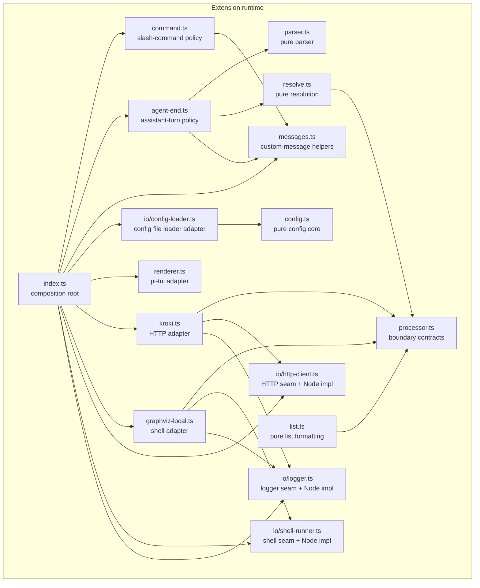

[< Docs](../README.md)

# Architecture map

**Last updated:** 2026-04-22 (`CVx.E3`)

Current-state map for refactoring pi-fence safely.

`CVx.E3` is now complete. This note no longer describes the old hotspots as pending work; it records the shape the refactor-confidence lane left behind.

## Vocabulary

| Term | Meaning in this repo | Current examples |
|------|-----------------------|------------------|
| **Pure module** | Logic with no ambient environment access and no direct dependency on external runtime services. Inputs come in as arguments; outputs come back as values. | `extensions/pi-fence/parser.ts`, `extensions/pi-fence/resolve.ts`, `extensions/pi-fence/list.ts`, `extensions/pi-fence/config.ts`, `scripts/verify/gallery.ts` |
| **Adapter** | Code that translates between pi-fence's contracts and an external library, runtime, or protocol. | `extensions/pi-fence/kroki.ts`, `extensions/pi-fence/graphviz-local.ts`, `extensions/pi-fence/renderer.ts`, `extensions/pi-fence/io/config-loader.ts`, `scripts/verify/pipeline.ts` |
| **Runtime seam** | An injected interface/value at an environment boundary: HTTP, subprocesses, logging, filesystem/config discovery, similar I/O. | `HttpClient`, `ShellRunner`, `Logger` under `extensions/pi-fence/io/` |
| **Composition root** | The file that chooses concrete runtime implementations and wires them to inner modules. Ambient reads are acceptable here; they are suspect in inner modules. | `extensions/pi-fence/index.ts`, `scripts/render-verify.ts`, `scripts/render-gallery.ts`, `scripts/inspect.ts` |
| **Policy module** | Runtime logic that coordinates pure modules and adapters without owning ambient Node access itself. | `extensions/pi-fence/agent-end.ts`, `extensions/pi-fence/command.ts`, `extensions/pi-fence/messages.ts` |
| **Hotspot** | A file or dependency edge where multiple responsibilities or blurry ownership make refactoring riskier than it should be. | Extension-runtime hotspots from `CVx.E3` are now cleared; remaining couplings are tooling-lane only. |

Two supporting terms remain useful in practice:

1. **Boundary contract** — a shared type/interface that pure modules and adapters agree on (`extensions/pi-fence/processor.ts`).
2. **Tooling lane** — repo scripts that support development and verification but are not the shipped extension runtime (`scripts/verify/**`, `scripts/render-gallery.ts`, `scripts/inspect.ts`, `scripts/lint-markdown-links.ts`).

## Extension runtime lane

The shipped extension runtime is the code under `extensions/pi-fence/` that pi loads.

### Current production module map

| Module | Category | Owns today | Dependencies worth noticing |
|--------|----------|------------|-----------------------------|
| `extensions/pi-fence/processor.ts` | Boundary contracts | `FenceProcessor`, `Availability`, `FenceResult` | Shared by pure modules and adapters; no runtime access |
| `extensions/pi-fence/parser.ts` | Pure module | Fenced-block extraction from markdown | No environment or SDK access |
| `extensions/pi-fence/resolve.ts` | Pure module | Processor resolution, availability probing wrapper, supported-tag collection | Depends only on `processor.ts` contracts |
| `extensions/pi-fence/list.ts` | Pure module | `/fence list` listing shape + string formatting | Depends only on contracts + binding-resolution data |
| `extensions/pi-fence/config.ts` | Pure module | Config defaults, validation, merge behavior | No `fs`, `path`, `homedir()`, or `process.cwd()` |
| `extensions/pi-fence/io/config-loader.ts` | Adapter | Config file discovery + file reads | Owns `fs`, `path`, `homedir()`, `process.cwd()` |
| `extensions/pi-fence/io/http-client.ts` | Runtime seam | `HttpClient`, `NodeHttpClient` | Production-owned seam home |
| `extensions/pi-fence/io/shell-runner.ts` | Runtime seam | `ShellRunner`, `NodeShellRunner` | Production-owned seam home |
| `extensions/pi-fence/io/logger.ts` | Runtime seam | `Logger`, `NodeLogger`, `shouldLog` | Production-owned seam home |
| `extensions/pi-fence/kroki.ts` | Adapter | `FenceProcessor` over HTTP | Depends on production-owned `HttpClient` + `Logger` |
| `extensions/pi-fence/graphviz-local.ts` | Adapter | `FenceProcessor` over local `dot` subprocess | Depends on production-owned `ShellRunner` + `Logger` |
| `extensions/pi-fence/messages.ts` | Policy module | Custom-message constants and payload builders/senders | Depends on list formatting + renderer detail types |
| `extensions/pi-fence/command.ts` | Policy module | `/fence` command behavior | Depends on `Logger` + message helpers |
| `extensions/pi-fence/agent-end.ts` | Policy module | Assistant-turn interception/render loop | Depends on parser + resolver + message helpers |
| `extensions/pi-fence/renderer.ts` | Adapter | pi custom-message rendering via pi-tui primitives | Depends on pi public types; runtime primitives injected by caller |
| `extensions/pi-fence/index.ts` | Composition root | Wires Node deps, default processors, config load, renderer registration, command policy, agent-end policy | The only runtime file that chooses concrete implementations by default |

### What is intentionally **not** a hotspot

1. `parser.ts`, `resolve.ts`, `list.ts`, and `config.ts` are already the direct, pure modules this repo wants.
2. `kroki.ts`, `graphviz-local.ts`, and `renderer.ts` are adapter-shaped and depend on explicit seams.
3. `index.ts` is now small enough to scan as a composition root rather than as an orchestration blob.
4. `command.ts`, `agent-end.ts`, and `messages.ts` are policy modules, not new ambient-runtime homes.

## Runtime seam inventory

These are the environment-dependent boundaries the extension runtime injects today.

| Seam | Current home | Current consumers | Status |
|------|--------------|-------------------|--------|
| `HttpClient` | `extensions/pi-fence/io/http-client.ts` | `extensions/pi-fence/index.ts`, `extensions/pi-fence/kroki.ts`, tests/utilities fakes | Production-owned after `CVx.E3.S3` |
| `ShellRunner` | `extensions/pi-fence/io/shell-runner.ts` | `extensions/pi-fence/index.ts`, `extensions/pi-fence/graphviz-local.ts`, tests/utilities fake + Docker wrapper | Production-owned after `CVx.E3.S3` |
| `Logger` | `extensions/pi-fence/io/logger.ts` | `extensions/pi-fence/index.ts`, `extensions/pi-fence/kroki.ts`, `extensions/pi-fence/graphviz-local.ts`, `extensions/pi-fence/io/config-loader.ts`, tests/utilities fake | Production-owned after `CVx.E3.S3` |
| Config file discovery + reads | `extensions/pi-fence/io/config-loader.ts` | `extensions/pi-fence/index.ts` | Explicit edge-owned adapter after `CVx.E3.S3` |
| Theme read from pi context | `extensions/pi-fence/agent-end.ts` via injected `ThemeState` | `extensions/pi-fence/index.ts` / `extensions/pi-fence/kroki.ts` | Still edge-owned; not a hidden ambient dependency in inner modules |

## Hotspot inventory

`CVx.E3` intentionally cleared the extension-runtime hotspots that existed when this note was first written.

| Former hotspot | Outcome |
|----------------|---------|
| Production imports from `tests/utilities/` | Cleared in `S3`. Runtime seams now live under `extensions/pi-fence/io/`, and `CVx.E4.S1` adds a dependency-cruiser rule so `extensions/**` importing from `tests/**` fails automatically. |
| Mixed config file I/O + pure config logic in `config.ts` | Cleared in `S3`. Pure logic lives in `config.ts`; file discovery/reads live in `io/config-loader.ts`. |
| `index.ts` as composition root + orchestration hotspot | Cleared in `S4`. Policy lives in `command.ts`, `agent-end.ts`, and `messages.ts`. |
| Internal names lagging behind the architecture vocabulary | Cleared in `S5`. Runtime deps and processor factories now use boundary-accurate names. |

The remaining deliberate couplings are in the tooling lane, not the shipped runtime lane.

## Repo-tooling / verifier lane

The repository has a second architectural lane: scripts that help contributors verify or showcase pi-fence.

These are **not** the shipped extension runtime, so they should not be forced into the exact same packaging constraints. They still benefit from the same vocabulary.

| Module | Category | Owns today | Notes |
|--------|----------|------------|-------|
| `scripts/verify/gallery.ts` | Pure module | HTML generation for render-verify galleries | Already the shape we want: data in, string out. |
| `scripts/verify/scenarios.ts` | Tooling composition + adapter mix | Scenario registry plus composition-level render construction | Intentionally imports extension renderer code and `tests/utilities/render.ts` to reuse the render-layer harness. |
| `scripts/verify/pipeline.ts` | Adapter | Headless Chromium + xterm.js + addon-image screenshot pipeline | Intentionally imports `tests/utilities/addon-image-overlay-fix.ts`; this is verifier infrastructure, not shipped runtime. |
| `scripts/render-verify.ts` | Tooling composition root | CLI entrypoint for scenario render verification | Chooses scenarios, runs the pipeline, writes outputs/goldens/gallery. |
| `scripts/render-gallery.ts` | Tooling composition root + online adapter use | Fetches live Kroki PNGs and emits a browsable gallery | Uses the verifier pipeline as a consumer-facing showcase, not as a test gate. |
| `scripts/inspect.ts` | Tooling composition root | Completion-pass analyzer wrapper | Runs the broader CRAP inspection path and optionally the Sonar experiment when configured. |
| `scripts/lint-markdown-links.ts` | Separate docs-tooling lane | Markdown link/fragment checker | Purely repo-maintenance tooling; independent of the extension runtime refactor plan. |

### Rule of thumb for this lane

1. Tooling code may reuse test harnesses when the harness is the most truthful way to reproduce what contributors need to inspect.
2. That reuse does **not** mean the helper automatically belongs under `extensions/pi-fence/`.
3. Promote a tooling helper out of `tests/utilities/` only when more than one long-lived non-test consumer makes the shared API real rather than convenient.

## Working rules for future refactors

1. Do **not** inject pure modules just for symmetry. `parser.ts`, `resolve.ts`, `list.ts`, and `config.ts` are already in the right shape.
2. Keep ambient runtime reads at the composition root or in explicit adapters. If a new inner module wants `process.cwd()`, `homedir()`, `fs`, subprocess, or network access directly, that is a design smell.
3. Keep policy modules dependency-injected: they coordinate seams and pure logic, but they do not become new ambient runtime homes.
4. Do not let tooling-lane couplings inflate the scope of extension-runtime refactors.
5. Treat this note as descriptive truth first. If the code shape changes, update the map so contributors do not refactor against stale folklore.
